

<picture>
  <source media="(prefers-color-scheme: dark)" srcset="assets/banner-dark.svg">
  <source media="(prefers-color-scheme: light)" srcset="assets/banner-light.svg">
  
</picture>

<picture>
  <source media="(prefers-color-scheme: dark)" srcset="assets/typing-dark.svg">
  <source media="(prefers-color-scheme: light)" srcset="assets/typing-light.svg">
  
</picture>

<picture>
  <source media="(prefers-color-scheme: dark)" srcset="assets/tags-dark.svg">
  <source media="(prefers-color-scheme: light)" srcset="assets/tags-light.svg">
  
</picture>

<picture>
  <source media="(prefers-color-scheme: dark)" srcset="assets/divider-dark.svg">
  <source media="(prefers-color-scheme: light)" srcset="assets/divider-light.svg">
  
</picture>

<picture>
  <source media="(prefers-color-scheme: dark)" srcset="assets/hdr-about-dark.svg">
  <source media="(prefers-color-scheme: light)" srcset="assets/hdr-about-light.svg">
  
</picture>

- **独立开发者** —— 主业做医疗健康方向的站点运营与 SEO，副业把想用的工具一个个做出来
- **一条链路** —— 采集 → 整理 → 加工 → 分发，找信息、排内容、发出去，每个环节都留了一个能用的轮子
- **主力技术栈** —— TypeScript / Vue / Nuxt，服务端 Python / PHP，需要落在本地就交给浏览器和 SQLite
- **本地优先** —— FavsHub 的书签与提示词、toolbox 的 47 款工具，数据都不经过第三方服务器
- **先做出来，再做好** —— 也喜欢把踩过的坑沉淀成能复用的方案，而不是一次性脚本
- **交流** —— 走 Issue 就行，每个仓库都开着；博客 [bx9y.com.cn](https://www.bx9y.com.cn)

<picture>
  <source media="(prefers-color-scheme: dark)" srcset="assets/terminal-dark.svg">
  <source media="(prefers-color-scheme: light)" srcset="assets/terminal-light.svg">
  
</picture>

<picture>
  <source media="(prefers-color-scheme: dark)" srcset="assets/divider-dark.svg">
  <source media="(prefers-color-scheme: light)" srcset="assets/divider-light.svg">
  
</picture>

<picture>
  <source media="(prefers-color-scheme: dark)" srcset="assets/hdr-pipeline-dark.svg">
  <source media="(prefers-color-scheme: light)" srcset="assets/hdr-pipeline-light.svg">
  
</picture>

<picture>
  <source media="(prefers-color-scheme: dark)" srcset="assets/pipeline-dark.svg">
  <source media="(prefers-color-scheme: light)" srcset="assets/pipeline-light.svg">
  
</picture>

<picture>
  <source media="(prefers-color-scheme: dark)" srcset="assets/divider-dark.svg">
  <source media="(prefers-color-scheme: light)" srcset="assets/divider-light.svg">
  
</picture>

<picture>
  <source media="(prefers-color-scheme: dark)" srcset="assets/hdr-stack-dark.svg">
  <source media="(prefers-color-scheme: light)" srcset="assets/hdr-stack-light.svg">
  
</picture>

<picture>
  <source media="(prefers-color-scheme: dark)" srcset="assets/stack-dark.svg">
  <source media="(prefers-color-scheme: light)" srcset="assets/stack-light.svg">
  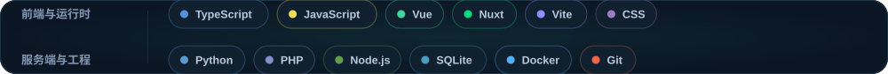
</picture>

<picture>
  <source media="(prefers-color-scheme: dark)" srcset="assets/lang-dark.svg">
  <source media="(prefers-color-scheme: light)" srcset="assets/lang-light.svg">
  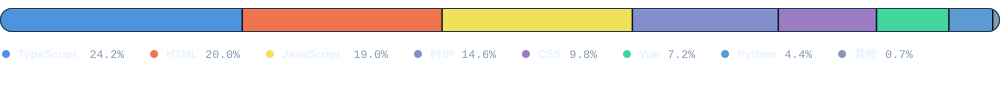
</picture>

<picture>
  <source media="(prefers-color-scheme: dark)" srcset="assets/divider-dark.svg">
  <source media="(prefers-color-scheme: light)" srcset="assets/divider-light.svg">
  
</picture>

<picture>
  <source media="(prefers-color-scheme: dark)" srcset="assets/hdr-projects-dark.svg">
  <source media="(prefers-color-scheme: light)" srcset="assets/hdr-projects-light.svg">
  
</picture>

  <a href="https://github.com/huanyu-a/FavsHub">
    <picture>
      <source media="(prefers-color-scheme: dark)" srcset="assets/proj-0-dark.svg">
      <source media="(prefers-color-scheme: light)" srcset="assets/proj-0-light.svg">
      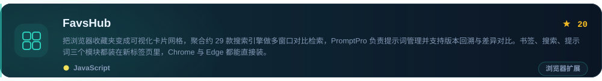
    </picture>
  </a>

  <a href="https://github.com/huanyu-a/MarkFlow">
    <picture>
      <source media="(prefers-color-scheme: dark)" srcset="assets/proj-1-dark.svg">
      <source media="(prefers-color-scheme: light)" srcset="assets/proj-1-light.svg">
      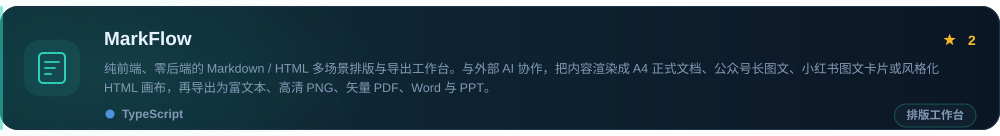
    </picture>
  </a>

  <a href="https://github.com/huanyu-a/FavsHub_web">
    <picture>
      <source media="(prefers-color-scheme: dark)" srcset="assets/proj-2-dark.svg">
      <source media="(prefers-color-scheme: light)" srcset="assets/proj-2-light.svg">
      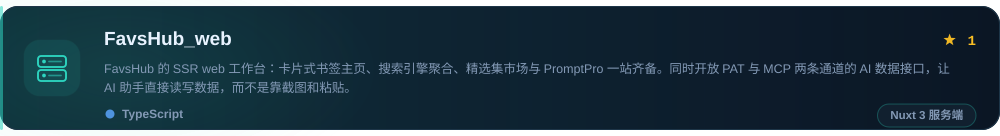
    </picture>
  </a>

  <a href="https://github.com/huanyu-a/toolbox">
    <picture>
      <source media="(prefers-color-scheme: dark)" srcset="assets/proj-3-dark.svg">
      <source media="(prefers-color-scheme: light)" srcset="assets/proj-3-light.svg">
      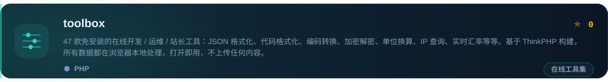
    </picture>
  </a>

还有一些小工具

- [FavsSnap_wechat-article-clip_ext](https://github.com/huanyu-a/FavsSnap_wechat-article-clip_ext) —— 微信文章剪藏扩展（MV3 侧边栏）
- [FavsSnap_wechat-article-clip](https://github.com/huanyu-a/FavsSnap_wechat-article-clip) —— 剪藏工具 Python 版
- [ScriptDeck_Script_Manager](https://github.com/huanyu-a/ScriptDeck_Script_Manager) —— Windows 脚本启动器
- [wx-auth](https://github.com/huanyu-a/wx-auth) —— 公众号扫码认证系统 · wx-auth-sdk
- [generate_shortcut_poster](https://github.com/huanyu-a/generate_shortcut_poster) —— Windows 快捷键速查海报生成
- [gzh-design-skill11](https://github.com/huanyu-a/gzh-design-skill11) —— 公众号排版 skill
- [ai-docs-mirror](https://github.com/huanyu-a/ai-docs-mirror) —— AI 技术文档镜像站

<picture>
  <source media="(prefers-color-scheme: dark)" srcset="assets/divider-dark.svg">
  <source media="(prefers-color-scheme: light)" srcset="assets/divider-light.svg">
  
</picture>

<picture>
  <source media="(prefers-color-scheme: dark)" srcset="assets/hdr-stats-dark.svg">
  <source media="(prefers-color-scheme: light)" srcset="assets/hdr-stats-light.svg">
  
</picture>

<picture>
  <source media="(prefers-color-scheme: dark)" srcset="assets/stats-dark.svg">
  <source media="(prefers-color-scheme: light)" srcset="assets/stats-light.svg">
  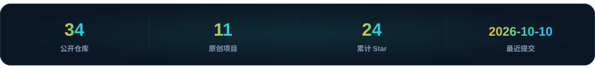
</picture>

上面这张卡片和这个页面的所有素材，都是本仓库自绘的 SVG：没有第三方图床，没有 shields.io，深浅色各一套。数据由 GitHub Action 每天自动重新抓取并重绘，最后一次更新于 2026-09-28。

原创项目 12 个，累计 24 个 Star。如果哪个仓库对你有用，点个 ⭐ 就是最好的鼓励。

  <picture>
    <source media="(prefers-color-scheme: dark)" srcset="assets/footer-dark.svg">
    <source media="(prefers-color-scheme: light)" srcset="assets/footer-light.svg">
    
  </picture>

